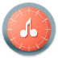

<!-- PROJECT LOGO -->
 

  

  <h1 align="center">MusicMetrics Database</h1>
  

    Discover, Rate, and Explore Music Like Never Before!
     
     
  

<!-- TABLE OF CONTENTS -->

  
Table of Contents

  <ol>
    <li><a href="#about-the-project">About the Project</a></li>
    <li><a href="#built-with">Built With</a></li>
    <li><a href="#getting-started">Getting Started</a></li>
    <li><a href="#future-enhancements">Future Enhancements</a></li>
    <li><a href="#contributing">Contributing</a></li>
    <li><a href="#disclaimer">Disclaimer</a></li>
    <li><a href="#contact">Contact</a></li>
    <li><a href="#publish-date">Publish Date</a></li>
  </ol>

<!-- ABOUT THE PROJECT -->

  <h2>About the Project</h2>
  
MusicMetrics Database (MMDb) is an Android app that allows music lovers to explore songs, rate their favorites, and see what’s trending in the music world.

  

    It utilizes Firebase to provide real-time updates on song ratings. As a POC, the app is currently using an external API 
    (<a href="https://developer.spotify.com/documentation/web-api">Spotify Web API</a>) to fetch song and album details.
  

  

    <video src="assets/videos/MMDb.mp4" width="320" height="240" controls></video>
  

  
<a href="#readme-top">back to top</a>

<!-- BUILT WITH -->

  <h2>Built With</h2>
  <ul>
    <li>Firebase for authentication, real-time database and storage</li>
    <li>Spotify Web API for song data</li>
    <li>Retrofit for API integration</li>
    <li>Dagger-Hilt for dependency injection</li>
  </ul>
  
<a href="#readme-top">back to top</a>

<!-- GETTING STARTED -->

  <h2>Getting Started</h2>
  
To get a local copy up and running follow these simple example steps.

  <ol>
    <li>
      
Register for a Spotify Developer account and get an <a href="https://developer.spotify.com/documentation/web-api/tutorials/getting-started">access token</a>.

    </li>
    <li>
        
Clone the repo in Android Studio.

        
<code>git clone https://github.com/magg-ting/music-metrics-db.git</code>

    </li>
    <li>
Enter your <strong>SPOTIFY_CLIENT_ID</strong> and <strong>SPOTIFY_CLIENT_SECRET</strong> in <code>local.properties</code>
</li>
    <li>
Change git remote url to avoid accidental pushes to base project.

      

        <code>git remote set-url origin github_username/repo_name</code> 
        <code>git remote -v # confirm the changes</code>
      

    </li>
  </ol>
  
<a href="#readme-top">back to top</a>

<!-- ROADMAP -->
<!--
## Roadmap

- [ ] Feature 1
- [ ] Feature 2
- [ ] Feature 3
    - [ ] Nested Feature

See the [open issues](https://github.com/magg-ting/music-metrics-db/issues) for a full list of proposed features (and known issues).

(<a href="#readme-top">back to top</a>)

-->

<!-- CONTRIBUTING -->

  <h2>Contributing</h2>
  
Contributions are what make the open source community such an amazing place to learn, inspire, and create. Any contributions you make are <em>greatly appreciated</em>.

  
If you have a suggestion that would make this better, please fork the repo and create a pull request. You can also simply open an issue with the tag "enhancement".

  
Don't forget to give the project a star! Thanks again!

  <ol>
    <li>Fork the Project</li>
    <li>Create your Feature Branch (<code>git checkout -b feature/AmazingFeature</code>)</li>
    <li>Commit your Changes (<code>git commit -m 'Add some AmazingFeature'</code>)</li>
    <li>Push to the Branch (<code>git push origin feature/AmazingFeature</code>)</li>
    <li>Open a Pull Request</li>
  </ol>
  
<a href="#readme-top">back to top</a>

<!-- DISCLAIMER -->

  <h2>Disclaimer</h2>
  
This app was originally developed as an individual college project. As a Proof-of-Concept instance, I used Spotify Web API to fetch the song data

  
<a href="#readme-top">back to top</a>

<!-- CONTACT -->

  <h2>Contact</h2>
  

    Feel free to reach out to <strong><a href="https://github.com/magg-ting/music-metrics-db/issues/new?labels=bug&template=bug-report---.md">Report Bug</a></strong> 
    or <strong><a href="https://github.com/magg-ting/music-metrics-db/issues/new?labels=enhancement&template=feature-request---.md">Request New Feature</a></strong>.
  

  
<a href="#readme-top">back to top</a>

<!-- PUBLISH DATE -->

  <h2>Publish Date</h2>
  
<strong>First published:</strong> 2024-08-29

  
<strong>Last modified:</strong> 2024-08-29
   
  
<a href="#readme-top">back to top</a>

<!-- MARKDOWN LINKS & IMAGES -->
<!-- https://www.markdownguide.org/basic-syntax/#reference-style-links -->
[product-screenshot]: assets/screenshots/feature-1.png

